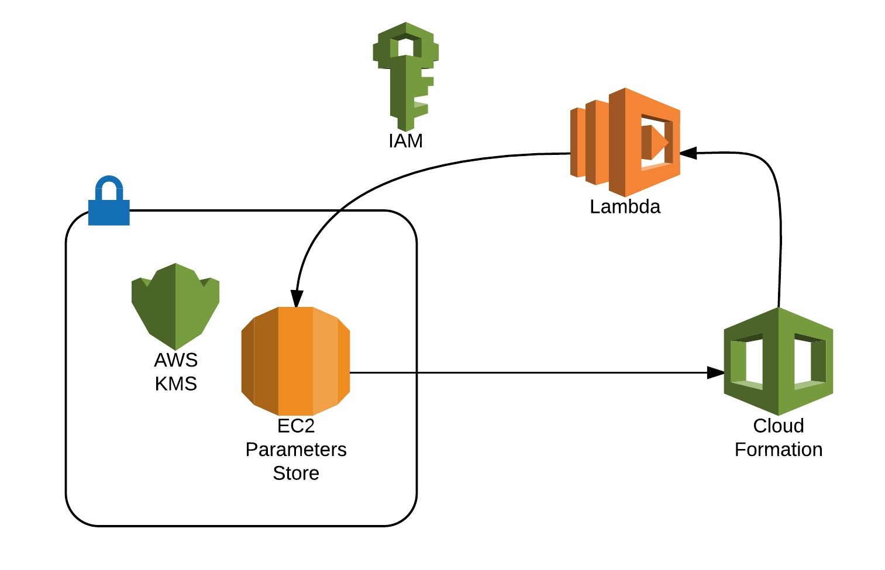

================================================
Secret Store Lambda for CloudFormation templates
================================================

Overview
--------

One topic very important in the AWS ecosystem is how to share secrets and parameters between applications.

Popular tools such as `Vault <https://www.vaultproject.io/>`_ and `Consul <https://www.consul.io/>`_ are oriented towards large enterprises with multiple levels of security. There are also other proprietary KMS systems which often require connectivity back to on premise locations. Another alternative may be a solution designed to run on the AWS platform, for example `credstash <https://github.com/fugue/credstash>`_. Such systems often have limitations. Credstash for example does not offer  permission level per secret based. Solutions are often chosen based on the InfoSec policy & potential compliance requirements.

Inspired by Chris Barclay's Article on `Managing Secrets for Amazon ECS Applications Using Parameter Store and IAM Roles for Tasks <https://aws.amazon.com/it/blogs/compute/managing-secrets-for-amazon-ecs-applications-using-parameter-store-and-iam-roles-for-tasks/>`_, I designed a solution fully integrated with Cloudformation using `Lambda-backed <http://docs.aws.amazon.com/AWSCloudFormation/latest/UserGuide/template-custom-resources-lambda.html>`_ custom resources and `SSM Parameter Store <https://aws.amazon.com/ec2/systems-manager/parameter-store/>`_. Such a solution is cloud native and builds on top of services with adequate SLA’s in place. The goal is to form a simple yet secure and effective solution for sharing secrets between deployments.

When a Cloudformation template invokes AWS Lambda Secretstore, the function is executed with a dedicated IAM role, retrieved from EC2 Parameter Store and the secret decrypted using KMS. The execution of Lambda returns back to Cloudformation the value from the Parameter Store which makes it possible to access it using the function `GetAtt <http://docs.aws.amazon.com/AWSCloudFormation/latest/UserGuide/intrinsic-function-reference-getatt.html>`_ reading the parameter “Value” and “Arn”. You can see a full example in the file ``resources/example-read.yaml``.

Why I used these AWS services
-----------------------------

`AWS Lambda backed custom Cloudformation resources <http://docs.aws.amazon.com/AWSCloudFormation/latest/UserGuide/template-custom-resources-lambda.html>`_ - provides cost efficiency with the use of all Lambda benefits and privileges segregated through IAM.

SSM Parameter Store - As SSM is fully integrated between all instances OS, it does not require any additional configuration. It also enables encryption of your secrets using KMS and allows you to `control permission access using IAM <http://docs.aws.amazon.com/systems-manager/latest/userguide/sysman-paramstore-access.html>`_

`AWS Key Management Service <https://aws.amazon.com/kms/details/>`_ (AWS KMS) is a managed service that makes it easy for you to create and control the encryption keys used to encrypt your data.

Getting Started
---------------

How To install
**************

1. Clone your repository

.. code:: bash

	$ git clone git@github.com:cloudreach/aws-cfn-secretstore.git
	$ cd aws-cfn-secretstore/

2. Editing the file ``serverless.yaml``, you can deploy your function in AWS using `Serverless Framework <https://serverless.com/framework/docs/providers/aws/cli-reference/>`_

.. code:: bash

  	$ serverless deploy
      Serverless: Packaging service...
      Serverless: Uploading CloudFormation file to S3...
      Serverless: Uploading function .zip files to S3...
      Serverless: Uploading service .zip file to S3 (64.18 KB)...
      Serverless: Creating Stack...
      Serverless: Checking Stack create progress...
      .......................
      Serverless: Stack create finished...
      Serverless: Removing old service versions...
      Service Information
      service: cfn-tools
      stage: prod
      region: eu-west-1
      api keys:
        None
      endpoints:
        None
      functions:
        secretstore: cfn-tools-prod-secretstore

and immediately test your deployment using:

.. code:: bash

	$ aws cloudformation create-stack --stack-name example-read-secretstore --template-body file://resources/example-read.yaml

Note that neither Cloudformation, Lambda or Parameter Store are global resources, so you will have to deploy the helper stack into each region.

How to quickly Manage your secret using CLI
*******************************************
In order to simply manage your secret, you can use `ssm AWS CLI <http://docs.aws.amazon.com/cli/latest/reference/ssm/index.html>`_ or a dedicated helper such as `ec2stash <https://github.com/giuliocalzolari/ec2stash>`_ to read/write and delete.

How to Contribute
*****************

We encourage contribution to our projects, please see our `CONTRIBUTING <CONTRIBUTING.rst>`_ guide for details.

License
-------

**aws-cfn-secretstore** is licensed under the `Apache Software License 2.0 <LICENSE>`_.

Thanks
------

Keep It Cloudy (`@CloudreachKIC <https://www.cloudreach.com/>`_)
